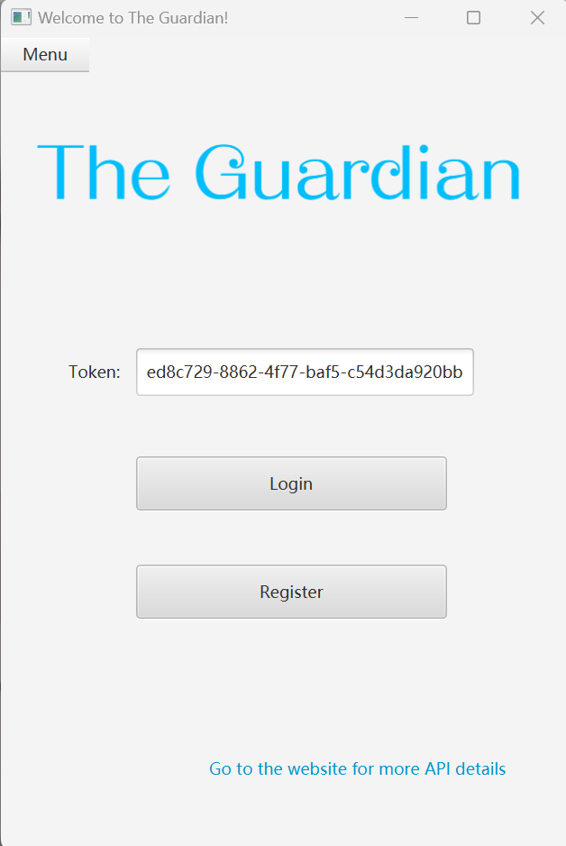
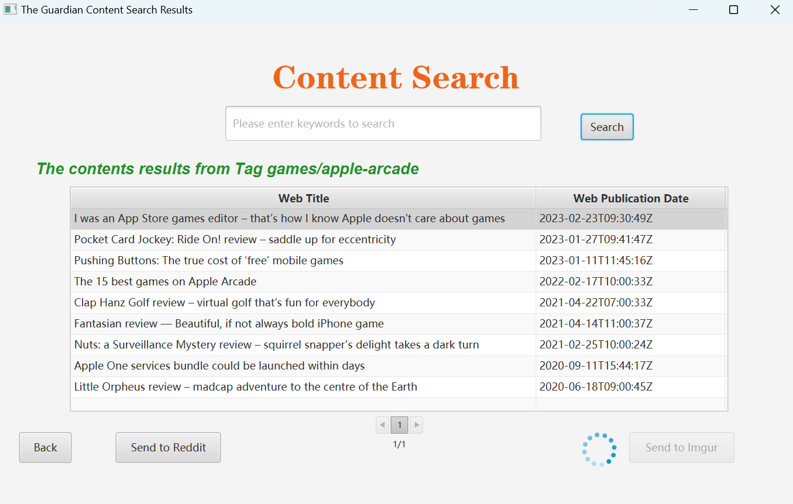

# the-guardian-application
A desktop application used with an input API The Guardian and output APIs to search tags and contents like a searching engine and then send the selected result to the output API. 

* Input API: [The Guardian](https://open-platform.theguardian.com/)
  A kind of online newspaper and information search platform.

* Output API 1: [Imgur](https://apidocs.imgur.com/)
  A web photo album site, mainly to provide free photo storage service.

* Output API 2: [Reddit](https://www.reddit.com/dev/api)
  A site allows users post text, links or other media information.
  

## Usage

### Prerequisite

The project mainly uses [Java 17](https://www.oracle.com/java/technologies/downloads/#java17) and [gradle 7.2](https://gradle.org/releases/) with some dependencies. You can also ues a higher version than they do.

### How to run
There are 2 modes (**online and offline**) for both input and output apis, so you can use the following commands on your terminal to start:

* `$ gradle run` The default mode is online for both input and output apis.

* `$ gradle run --args="online online"` Online input api and online output api

* `$ gradle run --args="online offline"`Online input api and offline output api

* `$ gradle run --args="offline online"`Offline input api and online output api

* `$ gradle run --args="offline offline"`Offline input api and offline output api

* `$ gradle test"`Run junit tests for the project

### Recommended

Set your **environment variables** on your PC as follow to make the application easier to use.

- Basic API key for input API: INPUT_API_KEY
- Imgur client id: IMGUR_API_KEY
- Imgur secret: IMGUR_API_SECRET
- Reddit client id: REDDIT_API_KEY
- Reddit secret: REDDIT_API_SECRET

## Functionality

- **Login in with a input api token**
  If you have set your environment variable for the input api key, it will show in the text filed automatically, or you can also type manualliy.

- **Click register to jump to the api website to get a key**
  If you do not have a key for the input api, you could go to the web site to register one.

- **Enter Tag key words in search bar with autocomple feature**
  Enter Tags in the search bar, you could get the suggested tags by clicking the drop-down box.

- **Search contents for the selected Tag**
  After clicking the search button with a selected tag in the tag search page, you will get a list of contents related to the tag in the content search page. Then, you could select a content or keep searching more relevant contents by entering key words.

- **View content details**
  Select a content of the table in the contont search page, and click it to view the information and jump to its website.

- **Output short form report**
  Once select a tag and a content about the tag, you can click the send button to send the infromation embedded in QR code as a image to send to the Imgur after you enter your output api **client id** and you can see the result by jumping to the website automatically  in your browser.

  
- **Cache is enabled when input API is online mode** Once a tag the user selecting to search hits the cache, a dialog would pop up to allow the user use cached date or use the new data from http requests to refresh cache.

- **Clear cache** Caching database file is retained on disk and is used after the app is closed and reopened. User is able to clear the cached data when using the app by clicking the Clear Cache button in the UI.

- **Preloading Interface** A 'splash' image with 15-second loading bar displayed is added when the application starts.

- **Help Feature** User could click the help menu in the menu bar to view the brief introduction, and also view the detailed usage of each component by both pressing CTRL and clicking it.

- **About Feature** User could click the about menu in the menu bar to vew the information about the application and related references.

- **Concurrency** Concurrency has been implemented to avoid the impacts by slow internet speed for api http requests. Thus, the UI could remain responsive whenever the api call is made.

- **Spinning progress indicator** A spinning progress indicator is added in the UI when an api call is made.

- **MVP** The MVP architecture is implemented, the details represent in `model`, `view` and `presenter` packages in the codebase.

- **Reddit posting feature** User could log in with a reddit account, and post text submission (the text report for output api). Remember to set environment variables `REDDIT_API_KEY` and `REDDIT_API_SECRET`in advance to ensure login with authentication successfully.

- **Tag search credits** At the start of the application the user is asked to enter a number between 1 and 10 (exclusive). This represents the number of tag searches (not content searches, just tags) the user is allowed to make that run. If the user e.g. enters 4, then searches for a 5th tag, an error should be displayed 'You have run out of search credits'. The current search credits remaining is displayed in the main window.

## Style Guide

Code style: Google Java Style Guide
https://google.github.io/styleguide/javaguide.html

# Contributing
### Current contributors
- Renjie He

If you would like to make improvements to the project, please contact us for permission to contribute. Feel free to dive in!
